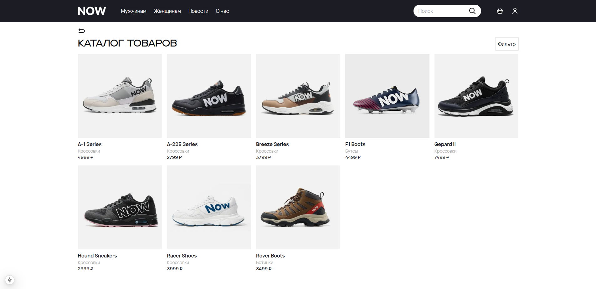
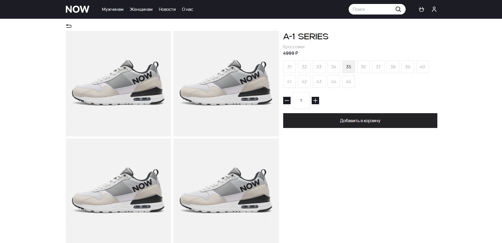
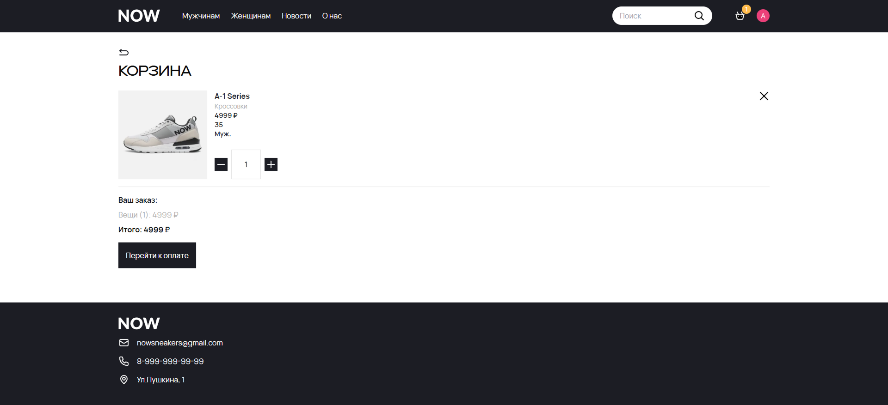
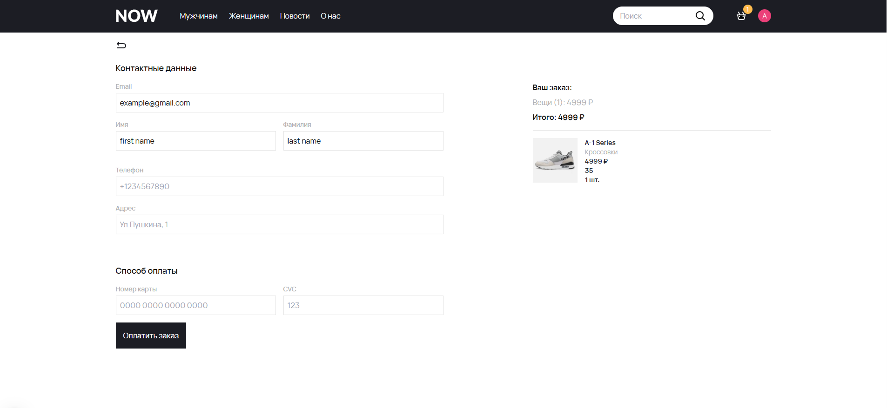
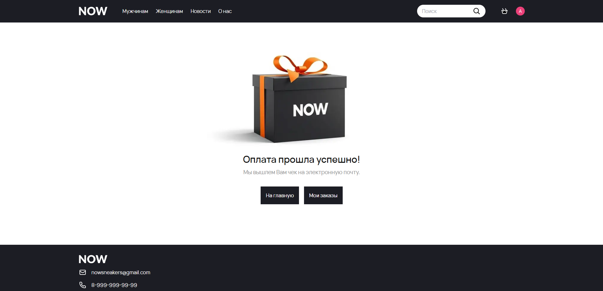

  

# Описание
NOW - вымышленный интернет-магазин обуви. 
# Особенности
- :key: Авторизация по логину и паролю, либо через Google
- :email: Отправка данных о заказе на электронную почту
- :arrows_counterclockwise: Возможность добавления, редактирования и удаления товаров в реальном времени через CMS Sanity
- :white_check_mark: Проверка форм на правильность заполнения
- :top: Улучшенная производительность за счет использования SSR 
- :mag: Фильтрация — поиск товаров по категориям

# Используемые технологии
- Next.js
- Tailwind CSS
- Sanity CMS
- Nodemailer
- Zod
- Shadcn/ui
- Zustand
- Clerk
- React Hot Toast
- React Hook Form

  
# Скриншоты (версия для компьютеров)
##  Главный экран:

##  Каталог товаров:

##  Страница товара:

##  Корзина:

##  Страница заказа:

##  Страница успешного заказа:

# Скриншоты (версия для мобильных устройств)
  Главный экран                 |   Каталог товаров        |  Страница товара
:-------------------------:|:-------------------------:|:-------------------------:
 |  | 

  Корзина                 |   Страница заказа       |  Страница успешного заказа
:-------------------------:|:-------------------------:|:-------------------------:
 |  | 

